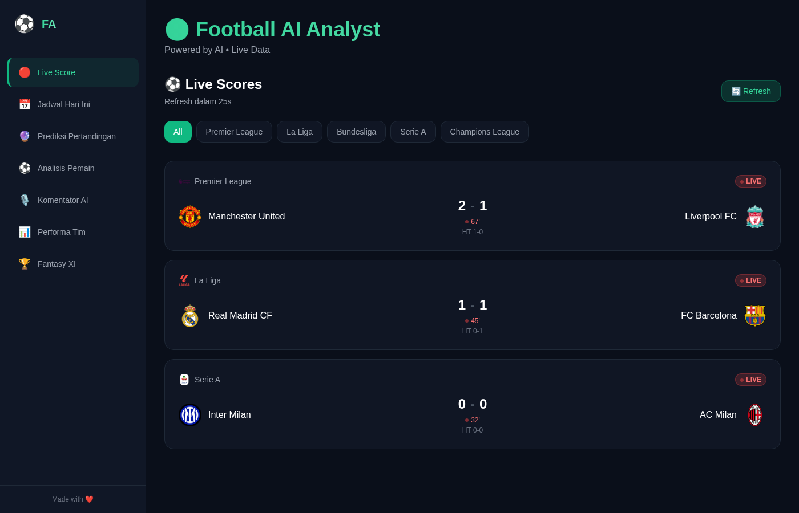
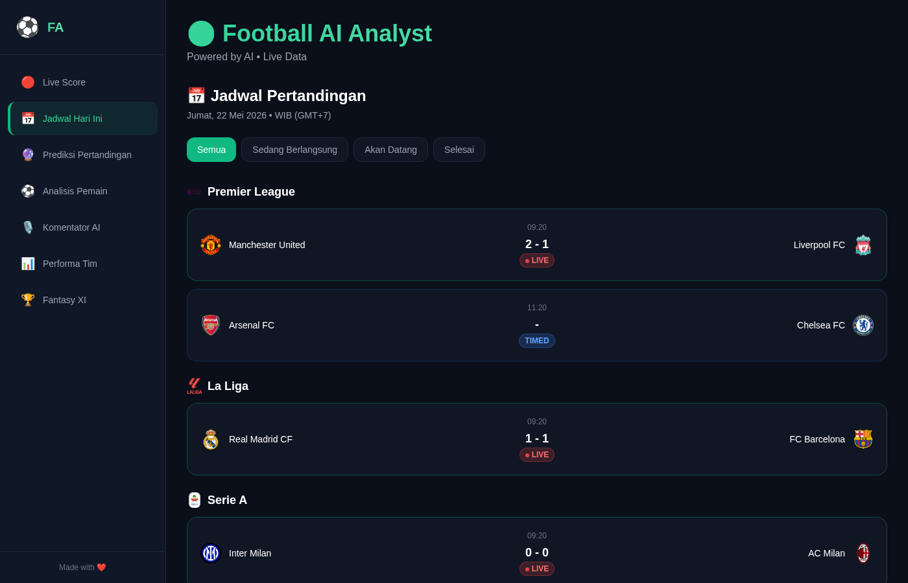
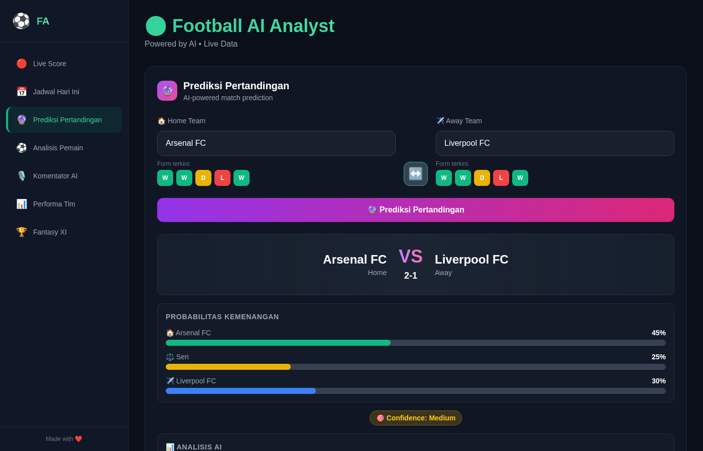
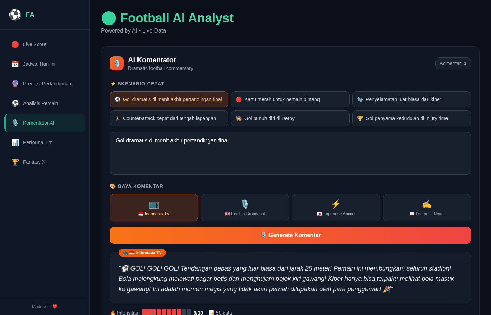
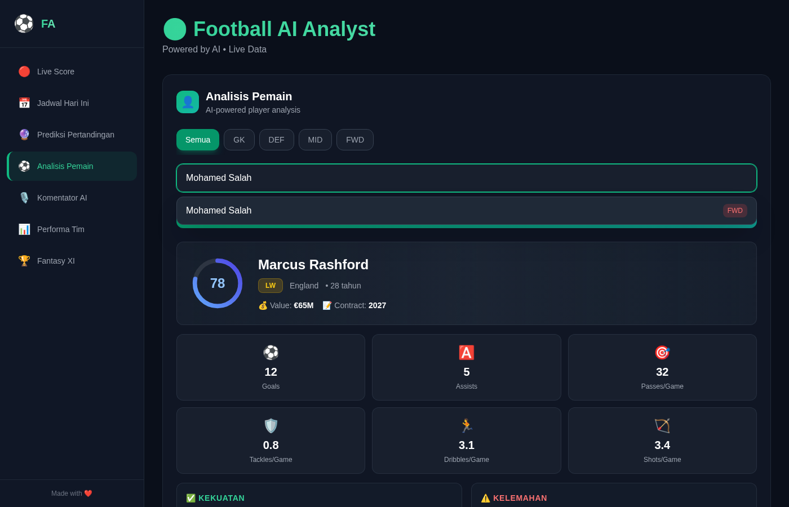
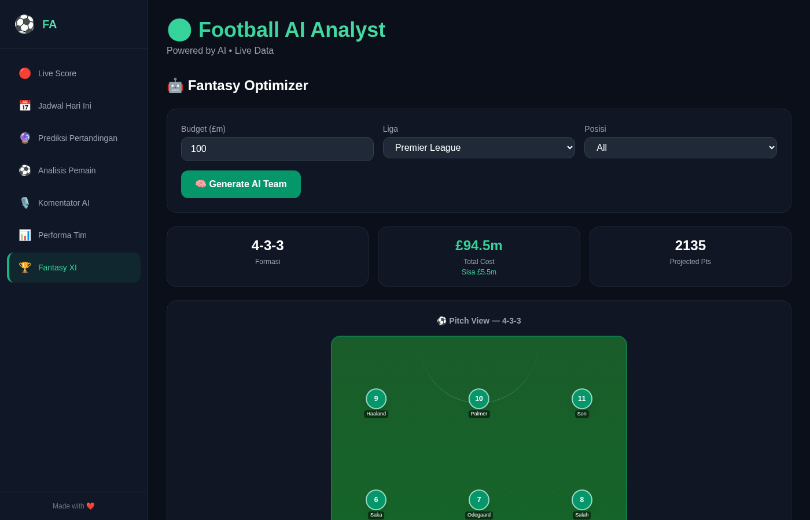

# ⚽ Football AI Analyst

> AI-powered football analysis dashboard with live scores, match predictions, player analysis, and more.


---

## 🚀 Features

| Fitur | Deskripsi |
|-------|-----------|
| 🔴 **Live Score** | Auto-refresh 30 detik, filter kompetisi (PL, La Liga, Bundesliga, Serie A, UCL) |
| 📅 **Jadwal Hari Ini** | Pertandingan hari ini grouped by liga, filter status (Live/Akan Datang/Selesai) |
| 🔮 **Prediksi Pertandingan** | AI prediksi skor, probabilitas kemenangan, analisis & faktor kunci |
| ⚽ **Analisis Pemain** | Rating, statistik, kekuatan/kelemahan, comparison antar pemain |
| 🎙️ **Komentator AI** | Generate komentar dramatis 4 gaya (Indonesia TV, English, Anime, Novel) |
| 📊 **Performa Tim** | Klasemen 5 liga + chart visual (bar chart goals, pie chart W/D/L) |
| 🏆 **Fantasy XI** | AI generate squad optimal di atas visual pitch formation |

## 📸 Screenshots

<table>
  <tr>
    <td></td>
    <td></td>
  </tr>
  <tr>
    <td></td>
    <td></td>
  </tr>
  <tr>
    <td></td>
    <td></td>
  </tr>
</table>

## 🛠 Tech Stack

- **Framework:** Next.js 14 (App Router)
- **Language:** TypeScript
- **Styling:** Tailwind CSS
- **Charts:** Recharts
- **AI:** OpenRouter API (Llama 3.1 8B free tier)
- **Football Data:** football-data.org API v4
- **Icons:** Emoji-based (no icon library needed)

## ⚡ Quick Start

```bash
# Clone
git clone <your-repo-url>
cd football-ai-analyst

# Install dependencies
npm install

# Run development server
npm run dev
```

Open [http://localhost:3000](http://localhost:3000)

## 🔑 Environment Variables

Copy `.env.local.example` to `.env.local`:

```bash
cp .env.local .env.local
```

| Variable | Required | Description |
|----------|----------|-------------|
| `FOOTBALL_API_KEY` | No | API key from [football-data.org](https://www.football-data.org/client/register) (free tier: 10 req/min) |
| `OPENROUTER_API_KEY` | No | API key from [OpenRouter](https://openrouter.ai/) (for real AI responses) |

> ⚠️ **Without API keys**, the app uses mock data and mock AI responses — fully functional for demo.

## 📁 Project Structure

```
football-ai-analyst/
├── app/
│   ├── layout.tsx              # Root layout with Inter font
│   ├── page.tsx                # Main page with tab navigation
│   ├── globals.css             # Tailwind + custom utilities
│   ├── api/
│   │   ├── football/route.ts   # Football API proxy + mock data
│   │   └── ai/route.ts         # OpenRouter AI proxy + mock responses
│   └── components/
│       ├── Sidebar.tsx         # Responsive sidebar (desktop/mobile)
│       ├── LiveScores.tsx      # Live match scores with auto-refresh
│       ├── MatchSchedule.tsx   # Today's match schedule
│       ├── MatchPredictor.tsx  # AI match prediction tool
│       ├── PlayerAnalyzer.tsx  # AI player analysis tool
│       ├── AICommentator.tsx   # AI commentary generator
│       ├── TeamPerformance.tsx # League standings + charts
│       └── FantasyOptimizer.tsx # AI fantasy team builder
├── public/
├── .env.local                  # Environment variables
├── package.json
├── tailwind.config.ts
├── tsconfig.json
└── next.config.js
```

## 🎯 How It Works

### Live Data Flow
```
User → Next.js Page → /api/football → football-data.org API
                                     ↓ (no key?)
                                     → Mock Data Response
```

### AI Features Flow
```
User Input → /api/ai → OpenRouter API (Llama 3.1 8B)
                      ↓ (no key?)
                      → Mock AI Response (context-aware)
```

### Mock Data

The app includes comprehensive mock data for offline/demo use:

- **3 live matches** (Man Utd vs Liverpool, Real Madrid vs Barcelona, Inter vs Milan)
- **6 daily matches** across 3 competitions
- **20 Premier League standings** with realistic stats
- **AI predictions** with team-aware analysis
- **Player analysis** with stats, strengths, weaknesses
- **4 commentary styles** with dramatic text
- **Fantasy squad** with real player names

## 🎨 Design

- **Theme:** Dark mode with emerald green accents
- **Cards:** Glassmorphism (backdrop-blur + semi-transparent)
- **Animations:** Fade-in transitions, pulse indicators, shimmer loading
- **Typography:** Inter font family
- **Responsive:** Sidebar collapses to horizontal scroll on mobile

## 📝 Available Scripts

```bash
npm run dev      # Start dev server (port 3000)
npm run build    # Production build
npm run start    # Start production server
```

## 🤝 Contributing

1. Fork the repository
2. Create your feature branch (`git checkout -b feature/amazing-feature`)
3. Commit your changes (`git commit -m 'Add amazing feature'`)
4. Push to the branch (`git push origin feature/amazing-feature`)
5. Open a Pull Request

## 📄 License

This project is open source and available under the [MIT License](LICENSE).

---

Built with ❤️ for football fans everywhere ⚽
